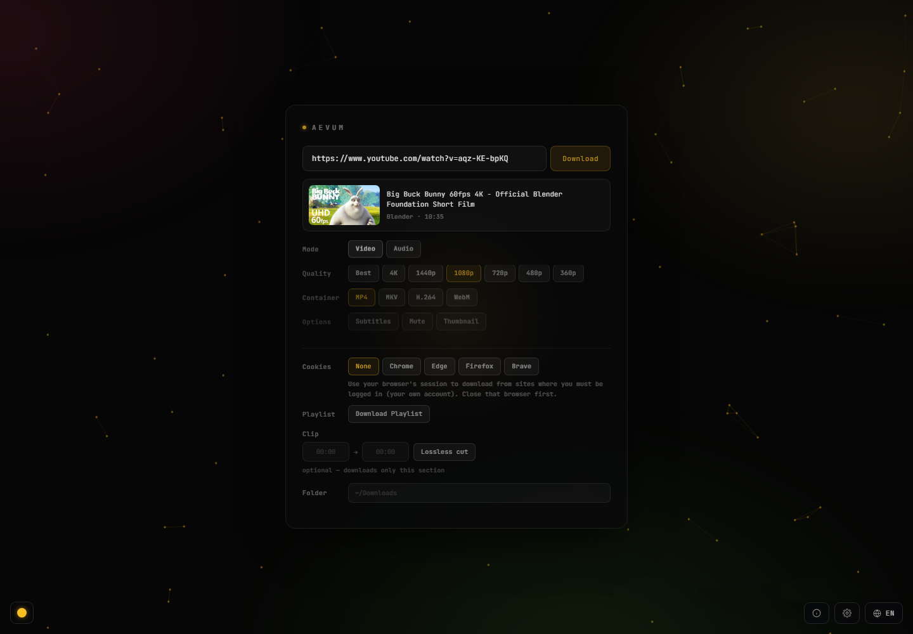

# Aevum

**Aevum** — a simple, self-contained desktop app to download videos and audio from **any site**: YouTube, Vimeo, Twitter/X, Dailymotion, Twitch, and ~1,800 more (anything [yt-dlp](https://github.com/yt-dlp/yt-dlp) supports). No installation, no dependencies: everything is bundled into a single executable (`.exe` on Windows, AppImage on Linux).

**Free, open source, and completely ad-free** — no ads, no tracking, no bundled extras. Just the download.



## Download

Two ways, both on the [**Releases**](../../releases) page:

- **`Aevum-Setup.exe`** — installer. Installs Aevum, with optional Desktop and Start Menu shortcuts, and an uninstaller. No admin rights needed.
- **`Aevum.exe`** — portable. Just double-click; no install.
- **`Aevum-x86_64.AppImage`** — Linux. Make it executable (`chmod +x`) and run; optionally add it to your app menu from Settings inside the app.

Aevum opens its interface in your browser (`localhost`). On **Windows** it lives in your system tray — right-click the tray icon to open or quit. On **Linux** there is no tray: the app runs while its browser tab is open and quits automatically when you close the tab (an active download keeps it alive until it finishes).

### Settings

Click the ⚙️ gear (next to the language picker) to open Settings. **Launch at startup** (Windows only) makes Aevum start with Windows and wait quietly in the tray (it does *not* pop the window open) — open it from the tray icon whenever you need it. On Linux the Settings panel offers **Add to app menu** instead, which installs Aevum as a regular menu app — it copies the AppImage into `~/.local/share/aevum/`, so you can delete the downloaded file afterwards; unticking removes the copy, menu entry and icon. Shown once on first run; changeable anytime.

### First run — the Windows "unknown publisher" warning

Aevum is not code-signed (a signing certificate costs money), so on the first run Windows **SmartScreen** shows a blue *"Windows protected your PC"* box. This is expected for small independent apps — it does **not** mean the app is unsafe. To run it:

1. Click **More info**.
2. Click **Run anyway**.

You only need to do this once.

### Is it safe? / Privacy

- **Open source** — all the code is in this repository; you can read exactly what it does.
- **Runs 100% locally** — Aevum only talks to the video sites you paste. It has no analytics, no accounts, no telemetry; nothing is sent to the developer.
- **Verify your download** — each release includes `checksums.txt` (SHA‑256). You can confirm the file you downloaded matches. A VirusTotal scan link is provided in the release notes.

## Features

- **Any site** — powered by yt-dlp, works far beyond YouTube.
- **Video or audio** — pick resolution (up to 4K), container (MP4/MKV), or extract audio (MP3/M4A/Opus/FLAC/WAV) at your chosen bitrate.
- **Subtitles** — download and embed subtitles (best-effort; never blocks the download).
- **Playlists** — download a whole playlist into an auto-created folder; endless YouTube Mixes are safely capped.
- **Login-only content** — use your browser's cookies to download from sites where you're signed in (your own account).
- **Stop button** — cancel a download at any time.
- **8 languages** — English, Türkçe, Español, Deutsch, Français, Italiano, Português, Русский. Your choice is remembered.
- **Self-contained** — yt-dlp and FFmpeg are bundled; nothing else to install.
- **No ads, no tracking** — no adware, no bundled toolbars, no telemetry. Everything runs locally.

## Legal / usage

Aevum is a general-purpose front-end for yt-dlp. Only download content you have the right to save — your own uploads, Creative Commons material, sites that permit downloading, or your own paid accounts. You are responsible for how you use it. This project does not endorse or enable copyright infringement.

## How it was built (honesty note)

Aevum was **vibe-coded with the help of an AI assistant** — it was written collaboratively with AI rather than hand-coded line by line. I'm stating this openly so no one is misled about how it came to be.

The real heavy lifting is done by two excellent open-source projects — [yt-dlp](https://github.com/yt-dlp/yt-dlp) (the actual downloading) and [FFmpeg](https://ffmpeg.org) (merging/converting). Aevum is essentially a clean, friendly, ad-free wrapper around them.

## Build from source

Requires Python 3.10+.

```bash
pip install flask pystray pillow pyinstaller
# Place yt-dlp.exe and ffmpeg.exe into a bin/ folder next to ytdl_tray.py
python -m PyInstaller --onefile --noconsole --name Aevum ^
  --icon app.ico --version-file version.txt ^
  --hidden-import pystray._win32 --collect-submodules pystray ^
  --add-data "bin/yt-dlp.exe;." --add-data "bin/ffmpeg.exe;." --add-data "fonts;fonts" ytdl_tray.py
```

Or just run `build.bat`.

## Licenses

Aevum's own code is released under the [MIT License](LICENSE). It bundles third-party tools with their own licenses — see [THIRD_PARTY_LICENSES.md](THIRD_PARTY_LICENSES.md). Notably, the bundled FFmpeg build is licensed under the **GPL**.
